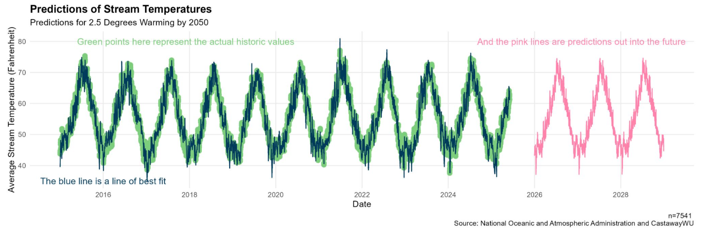

## The one-liner

> We integrated stream temperature, weather, and canopy coverage data into a predictive model for future stream temperatures so that
> the city of Salem can quantify the change in stream temperature and take preventative measures to protect stream ecosystems.

**Role:** I led data exploration, data analysis, and data visualization  
**Team:** Brooke Proctor and Serenna Walter  
**Repo:** [https://github.com/Serenna4/Emerald-Ash-Borer-Capstone-Project](https://github.com/Serenna4/Emerald-Ash-Borer-Capstone-Project)

## The question

Global bodies of water are warming faster than air heatwaves, causing severe drops in dissolved oxygen, increased algal blooms, and compounded risks to aquatic life, human health, and water security (Bush, 2025; EPA, 2025; CDC, 2026). While riparian vegetation vital for shading streams faces destruction from urban growth and the invasive Emerald Ash Borer, Salem, Oregon currently lacks prior research or predictive modeling to address these localized threats (University of Georgia, 2026; City of Salem, 2026). To pioneer an actionable tool for local stakeholders, this study addresses two central research questions. 
1. WWhat features improve future stream predictions from a base model using only stream temperature data, and can a 90% R-squared value be achieved using any combination of features?
2. Can a model be used to predict Salem’s stream temperature 3 years into the future based on different levels of anticipated climate change impact on the weather data?

## The data

The pipeline combines four static datasets (spanning CSVs, shapefiles, and spatial database tables) into a unified PostgreSQL instance hosted on Railway:
* Mill Creek Stream Data: 7,543 rows (~426 KB CSV) tracking daily temperatures, dissolved oxygen, and turbidity at two sites (MIC3 & MIC12) from 2015 onward.
* NOAA Salem Climate Data: 48,603 rows (~15.1 MB CSV) containing daily weather metrics (temperatures, precipitation, wind speed, snow depth).
* City of Salem Waterways: Spatial shapefile of 2,672 rows (~619 KB) defining public stream geometries.
* City of Salem Tree Canopy: Restricted spatial shapefile of 3,649 rows (~3.18 MB) containing land cover and tree canopy polygons.

The main data engineering challenge was bringing together completely different types of data—daily measurements, weather reports, and map overlays—into one clean, usable dataset. First, geographic map files had to be processed in ArcGIS to measure the tree cover within a 100-foot zone around two specific creek sites, turning complex visual maps into yearly percentages. The biggest hurdle was matching these once-a-year tree numbers with tens of thousands of daily weather and water temperature records collected over several years. On top of that, the weather data had missing values that couldn't simply be filled in as zeros, requiring careful cleaning and filtering so inaccurate information wouldn't throw off the results. In the end, all four data sources were structured into a single organized database, ensuring every piece linked together correctly and remained easy to query for analysis.

## The approach

To evaluate feature impact on stream temperature predictions, multiple linear regression models with coefficient interactions were built iteratively in R using combinations of stream quality, NOAA weather, and tree canopy metrics. Model validity was verified using standard diagnostic plots to confirm linearity, normality of residuals, homoscedasticity, and leverage. This process led to identifying and removing three statistical outliers caused by a freak historical weather event in Oregon. Across all iterations, performance was tracked against target benchmarks of an R-squared above 0.90 alongside RMSE and MAE values below 5°F to ensure low prediction error.

## Findings

{fig-alt="Best Performing Stream Temperature Predictive Model with Future Estimates" width="90%"}

This project shows that historic stream temperature data can be used to predict stream temperature with a high R-squared value of at least 90.0%, according to the best model in this project. The inclusion of weather data increases this model’s performance with an R-squared value of 94.5%. The addition of tree canopy data increases the model’s performance with an R-squared value of 94.7%. However, since this data has an extremely limited range for year, it is difficult to tell if the addition of the tree canopy data would truly improve the model over the same period as the other models, or if its increased R-squared value is simply due to fewer observations.

Many predictors showed a highly significant relationship with the outcome variable  (p < 0.001), including location, all years except 2021, precipitation, air temperature, months April through November, the interaction of precipitation and air temperature, and the interaction between day_of_month and the months March through November. See Appendix A for more information about the statistical significance for each variable in Model 4.

The first challenge encountered throughout this project was a lack of reliable data relevant to this research topic. Initially, a dataset on the Emerald Ash Borers had been identified that could be used to determine the beetle’s impact on Salem’s tree population, and this source could be applicable to stream temperatures. This dataset was ruled out after challenges arose when attempting to web-scrape and collect the data. The resulting data from the scrape only included 3 confirmed sightings of Emerald Ash Borers in Salem, which would not have been enough data to add to the models that were created. Another potential dataset contained every recorded tree in Salem, as well as what type of tree it was and where; however, when this data was web-scraped, the results were unreliable. Thus, the project direction had to pivot multiple times as new data sources with different contents were found. This left less time available for in-depth analysis and model creation, resulting in a heftier future work section. 

In terms of data limitations, large assumptions were made to create the models. Linear regression models assume that there is no multicollinearity between independent variables. Unfortunately, multiple variables in the weather dataset are known to be highly correlated, such as precipitation and maximum temperature. To reduce the impact of this multicollinearity, the chosen model, model 4, has the highly correlated variables multiplied by one another in the model fitting. This communicates to the model that it should calculate three coefficients for these two variables to account for the correlation between them. There is still a risk that the model is underrepresenting the significance of highly correlated variables. However, the Variance Inflation Factor value that was calculated indicated that the correlated variables did not negatively impact the chosen model. 

Finally, the predictive model has practical limitations which must be considered before its use. The most notable piece to consider is that strong assumptions must be made about future weather to predict stream temperature for that time period. Thus, the results are very dependent on human choices, which can introduce bias. Based on this knowledge, these predictions are meant to give an indefinite sense of possible stream temperatures in the future. Predictions using these models should not be taken as fact, but as a guideline toward action in combination with advice from domain experts.

## The full write-up

[Download the write-up (PDF)](projects/capstone/writeup.pdf){.btn .btn-primary}

## Dig deeper

- 📦 **Code & pipeline:** [Github Repo](https://github.com/Serenna4/Stream-Temperature-Capstone-Project)
- 📊 **Poster:** [Download the poster (PDF)](projects/capstone/510-Capstone_Poster.pdf){.btn .btn-primary}